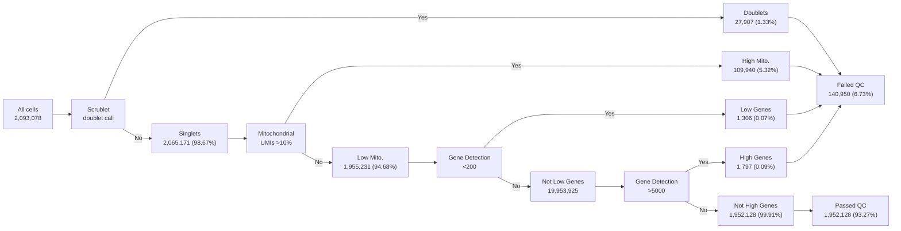

```mermaid
flowchart LR

all["All cells\n2,093,078"] --> scrublet["Scrublet\ndoublet call"]
scrublet -- Yes --> doublets["Doublets\n27,907 (1.33%)"]
scrublet -- No --> singlets["Singlets\n2,065,171 (98.67%)"]
singlets --> mito["Mitochondrial\nUMIs >10%"]
mito -- Yes --> high_mito["High Mito.\n109,940 (5.32%)"]
mito -- No --> low_mito["Low Mito.\n1,955,231 (94.68%)"]
low_mito --> low_test["Gene Detection\n<200"]
low_test -- Yes --> low_genes["Low Genes\n1,306 (0.07%)"]
low_test -- No --> not_low_genes["Not Low Genes\n19,953,925"]
not_low_genes --> high_test["Gene Detection\n>5000"]
high_test -- Yes --> high_genes["High Genes\n1,797 (0.09%)"]
high_test -- No --> not_high_genes["Not High Genes\n1,952,128 (99.91%)"]
not_high_genes --> pass["Passed QC\n1,952,128 (93.27%)"]
doublets --> fail["Failed QC\n140,950 (6.73%)"]
high_mito --> fail
low_genes --> fail
high_genes --> fail
```
